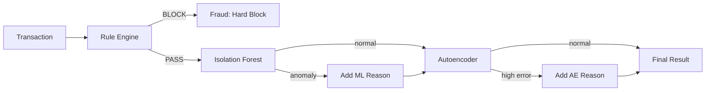
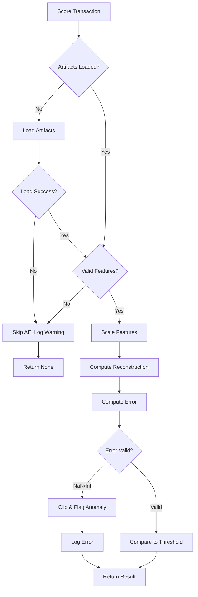

# Design Document: Autoencoder Integration

## Overview

This design document describes the integration of an Autoencoder-based anomaly detection model into the existing Banking Anomaly Detection System. The Autoencoder will serve as a third layer of fraud detection, complementing the Rule Engine (hard blocking) and Isolation Forest (ML anomaly scoring) with behavioral anomaly detection based on reconstruction error.

The Autoencoder learns to compress and reconstruct normal transaction patterns. Transactions that cannot be accurately reconstructed (high reconstruction error) are flagged as potential anomalies. This approach captures subtle behavioral deviations that may not trigger rule-based or tree-based detection methods.

### Key Design Principles

1. **Non-Breaking Integration**: All existing functionality remains unchanged
2. **Graceful Degradation**: System continues operating if Autoencoder artifacts are unavailable
3. **Metric Consistency**: Scaler and threshold are persisted to ensure reproducible inference
4. **Separation of Concerns**: Training, inference, and integration are modular components

## Architecture

```mermaid
flowchart TD
    subgraph Training["Training Pipeline (Offline)"]
        D1[engineered_transaction_features.csv] --> FE[Feature Extraction]
        FE --> SC[StandardScaler Fit]
        SC --> |scaled features| AE_TRAIN[Autoencoder Training]
        AE_TRAIN --> |reconstruction errors| TH[Threshold Computation]
        
        SC --> |save| SCALER[autoencoder_scaler.pkl]
        AE_TRAIN --> |save| MODEL[autoencoder.h5]
        TH --> |save| THRESH[autoencoder_threshold.json]
        
        MODEL --> VAL[Post-Training Validation]
        SCALER --> VAL
        VAL --> |verify metrics| DONE[Training Complete]
    end
    
    subgraph Inference["Inference Pipeline (Online)"]
        TXN[Transaction Input] --> HD[Hybrid Decision Engine]
        
        HD --> RE[Rule Engine]
        RE --> |block/pass| IF[Isolation Forest]
        IF --> |risk score| AE_INF[Autoencoder Inference]
        
        SCALER2[autoencoder_scaler.pkl] --> AE_INF
        MODEL2[autoencoder.h5] --> AE_INF
        THRESH2[autoencoder_threshold.json] --> AE_INF
        
        AE_INF --> |reconstruction error + reason| RESULT[Final Decision]
    end
```



### Decision Flow Priority



## Components and Interfaces

### 1. Autoencoder Model (`backend/autoencoder.py`)

The core neural network architecture for learning normal transaction patterns.

```python
class TransactionAutoencoder:
    """
    Keras-based Autoencoder for transaction anomaly detection.
    
    Architecture:
    - Input Layer: n_features (matches engineered features)
    - Encoder: Dense layers with decreasing dimensions
    - Bottleneck: Compressed representation
    - Decoder: Dense layers with increasing dimensions
    - Output Layer: n_features (reconstruction)
    """
    
    def __init__(self, input_dim: int, encoding_dim: int = 14, hidden_layers: List[int] = None):
        """
        Initialize Autoencoder architecture.
        
        Args:
            input_dim: Number of input features
            encoding_dim: Size of the bottleneck layer (default: 14, ~half of typical feature count)
            hidden_layers: Optional custom layer dimensions [64, 32, 14, 32, 64]
        """
        pass
    
    def build_model(self) -> keras.Model:
        """Build and compile the Keras model with MSE loss."""
        pass
    
    def fit(self, X: np.ndarray, epochs: int = 50, batch_size: int = 32, 
            validation_split: float = 0.1) -> keras.callbacks.History:
        """Train the Autoencoder on scaled features."""
        pass
    
    def predict(self, X: np.ndarray) -> np.ndarray:
        """Reconstruct input features."""
        pass
    
    def compute_reconstruction_error(self, X: np.ndarray) -> np.ndarray:
        """Compute MSE between input and reconstruction for each sample."""
        pass
    
    def save(self, path: str) -> None:
        """Save model to .h5 format."""
        pass
    
    @classmethod
    def load(cls, path: str) -> 'TransactionAutoencoder':
        """Load model from .h5 format."""
        pass
```

### 2. Training Pipeline (`backend/train_autoencoder.py`)

Orchestrates the complete training workflow.

```python
class AutoencoderTrainer:
    """
    Training pipeline for the Transaction Autoencoder.
    
    Responsibilities:
    - Load and prepare training data
    - Fit and save scaler
    - Train Autoencoder model
    - Compute and save threshold
    - Validate saved artifacts
    """
    
    # Configuration
    DATA_PATH = 'data/engineered_transaction_features.csv'
    MODEL_PATH = 'models/autoencoder.h5'
    SCALER_PATH = 'backend/autoencoder_scaler.pkl'
    THRESHOLD_PATH = 'models/autoencoder_threshold.json'
    
    # Feature list (same as Isolation Forest)
    FEATURES = [
        'transaction_amount', 'flag_amount', 'transfer_type_encoded', 'transfer_type_risk',
        'channel_encoded', 'deviation_from_avg', 'amount_to_max_ratio', 'rolling_std',
        'hour', 'day_of_week', 'is_weekend', 'is_night',
        'user_avg_amount', 'user_std_amount', 'user_max_amount', 'user_txn_frequency',
        'intl_ratio', 'time_since_last', 'recent_burst',
        'txn_count_30s', 'txn_count_10min', 'txn_count_1hour',
        'hourly_total', 'hourly_count', 'daily_total', 'daily_count'
    ]
    
    def __init__(self, k: float = 3.0):
        """
        Initialize trainer with threshold multiplier.
        
        Args:
            k: Standard deviation multiplier for threshold (default: 3.0)
        """
        pass
    
    def load_data(self) -> pd.DataFrame:
        """Load engineered features from CSV."""
        pass
    
    def fit_scaler(self, X: np.ndarray) -> StandardScaler:
        """Fit and save StandardScaler."""
        pass
    
    def train(self) -> dict:
        """
        Execute full training pipeline.
        
        Returns:
            dict with training metrics: {
                'threshold': float,
                'mean_error': float,
                'std_error': float,
                'k': float,
                'n_samples': int,
                'n_features': int
            }
        """
        pass
    
    def compute_threshold(self, errors: np.ndarray) -> dict:
        """
        Compute threshold from reconstruction errors.
        
        Formula: threshold = mean(errors) + k * std(errors)
        
        Returns:
            dict: {'threshold': float, 'mean': float, 'std': float, 'k': float}
        """
        pass
    
    def save_threshold(self, threshold_config: dict) -> None:
        """Save threshold configuration to JSON."""
        pass
    
    def validate_saved_model(self, X_sample: np.ndarray, expected_errors: np.ndarray) -> bool:
        """
        Validate that saved model reproduces training metrics.
        
        Returns:
            True if validation passes, raises exception otherwise
        """
        pass
```

### 3. Inference Module (`backend/autoencoder.py`)

Handles loading artifacts and scoring transactions.

```python
class AutoencoderInference:
    """
    Inference module for Autoencoder-based anomaly detection.
    
    Handles:
    - Loading model, scaler, and threshold
    - Scaling input features
    - Computing reconstruction error
    - Generating human-readable anomaly reasons
    """
    
    def __init__(self):
        """Initialize inference module (lazy loading of artifacts)."""
        self.model = None
        self.scaler = None
        self.threshold_config = None
        self._loaded = False
    
    def load_artifacts(self) -> bool:
        """
        Load model, scaler, and threshold.
        
        Returns:
            True if all artifacts loaded successfully, False otherwise
        """
        pass
    
    def is_available(self) -> bool:
        """Check if Autoencoder inference is available."""
        pass
    
    def score_transaction(self, features: dict) -> dict:
        """
        Score a single transaction.
        
        Args:
            features: dict of feature name -> value
            
        Returns:
            dict: {
                'reconstruction_error': float,
                'threshold': float,
                'is_anomaly': bool,
                'reason': str or None
            }
        """
        pass
    
    def _validate_features(self, features: dict) -> bool:
        """Validate that input features match expected schema."""
        pass
    
    def _handle_invalid_error(self, error: float) -> tuple[float, str]:
        """Handle NaN/inf reconstruction errors."""
        pass
```

### 4. Hybrid Decision Integration (`backend/hybrid_decision.py`)

Updated decision engine incorporating Autoencoder.

```python
def make_decision(txn: dict, user_stats: dict, model, features: list, 
                  autoencoder: AutoencoderInference = None) -> dict:
    """
    Make fraud decision using Rule Engine, Isolation Forest, and Autoencoder.
    
    Decision Priority:
    1. Rule Engine - Hard blocks (velocity, monthly limits)
    2. Isolation Forest - ML anomaly detection
    3. Autoencoder - Behavioral anomaly detection
    
    Args:
        txn: Transaction data
        user_stats: User statistics
        model: Isolation Forest model
        features: Feature list for Isolation Forest
        autoencoder: Optional AutoencoderInference instance
        
    Returns:
        dict: {
            'is_fraud': bool,
            'reasons': list[str],
            'risk_score': float,
            'threshold': float,
            'ml_flag': bool,
            'ae_flag': bool,
            'ae_reconstruction_error': float or None
        }
    """
    pass
```

## Data Models

### Threshold Configuration Schema

```json
{
    "threshold": 0.065,
    "mean": 0.023,
    "std": 0.014,
    "k": 3.0,
    "computed_at": "2024-01-15T10:30:00Z",
    "n_samples": 10000,
    "n_features": 26
}
```

### Autoencoder Result Schema

```python
@dataclass
class AutoencoderResult:
    reconstruction_error: float      # MSE between input and reconstruction
    threshold: float                 # Threshold used for comparison
    is_anomaly: bool                 # True if error > threshold
    reason: Optional[str]            # Human-readable reason if anomaly
    
    # Example reason format:
    # "Autoencoder anomaly: reconstruction error 0.081 exceeds threshold 0.065"
```

### Feature Vector Schema

The Autoencoder uses the same 26 features as the Isolation Forest:

| Feature | Type | Description |
|---------|------|-------------|
| transaction_amount | float | Transaction amount in AED |
| flag_amount | int | 1 if overseas transfer, 0 otherwise |
| transfer_type_encoded | int | Encoded transfer type (0-4) |
| transfer_type_risk | float | Risk score for transfer type (0.0-0.9) |
| channel_encoded | int | Encoded channel ID |
| deviation_from_avg | float | Absolute deviation from user average |
| amount_to_max_ratio | float | Ratio of amount to user's max transaction |
| rolling_std | float | Rolling standard deviation (last 5 txns) |
| hour | int | Hour of transaction (0-23) |
| day_of_week | int | Day of week (0-6) |
| is_weekend | int | 1 if weekend, 0 otherwise |
| is_night | int | 1 if night hours, 0 otherwise |
| user_avg_amount | float | User's average transaction amount |
| user_std_amount | float | User's transaction amount std dev |
| user_max_amount | float | User's maximum transaction amount |
| user_txn_frequency | int | User's total transaction count |
| intl_ratio | float | Ratio of international transactions |
| time_since_last | float | Seconds since last transaction |
| recent_burst | int | 1 if burst activity detected |
| txn_count_30s | int | Transactions in last 30 seconds |
| txn_count_10min | int | Transactions in last 10 minutes |
| txn_count_1hour | int | Transactions in last 1 hour |
| hourly_total | float | Total amount in current hour |
| hourly_count | int | Transaction count in current hour |
| daily_total | float | Total amount today |
| daily_count | int | Transaction count today |

## Frontend Integration (`app.py`)

The Streamlit frontend will be updated to display Autoencoder results alongside existing Rule Engine and Isolation Forest outputs.

### Changes Required

```python
# Import AutoencoderInference
from backend.autoencoder import AutoencoderInference

# Initialize AE inference (lazy loading)
@st.cache_resource
def get_autoencoder():
    """Load Autoencoder inference module."""
    ae = AutoencoderInference()
    if ae.load_artifacts():
        return ae
    else:
        st.warning("Autoencoder not available - running without behavioral anomaly detection")
        return None

# Update dashboard to pass AE to make_decision
def dashboard(df, model, features):
    ae = get_autoencoder()
    # ... existing code ...
    
    # In transaction processing:
    result = make_decision(txn, user_stats, model, features, autoencoder=ae)
```

### UI Display Updates

| Field | Display Location | Format |
|-------|-----------------|--------|
| AE Reconstruction Error | Result panel | "AE Error: 0.081" |
| AE Threshold | Result panel | "AE Threshold: 0.065" |
| AE Anomaly Reason | Reasons list | Full human-readable string |
| AE Status | Sidebar | "Autoencoder: Active" or "Autoencoder: Unavailable" |

### Graceful Degradation in UI

```python
# Display AE status in sidebar
if ae is not None and ae.is_available():
    st.sidebar.success("🧠 Autoencoder: Active")
else:
    st.sidebar.warning("🧠 Autoencoder: Unavailable")

# In result display, only show AE fields if available
if result.get('ae_reconstruction_error') is not None:
    st.info(f"🔬 AE Error: {result['ae_reconstruction_error']:.4f} | Threshold: {result.get('ae_threshold', 'N/A')}")
```


## Correctness Properties

*A property is a characteristic or behavior that should hold true across all valid executions of a system—essentially, a formal statement about what the system should do. Properties serve as the bridge between human-readable specifications and machine-verifiable correctness guarantees.*

The following properties are derived from the acceptance criteria and will be validated using property-based testing with the `hypothesis` library.

### Property 1: Model Round-Trip Consistency

*For any* valid trained Autoencoder model and any valid input feature vector, saving the model to `.h5` format then loading it SHALL produce a model that generates identical reconstruction errors (within floating-point tolerance of 1e-6).

**Validates: Requirements 2.6, 3.1, 3.3, 4.1, 7.1**

### Property 2: Scaler Round-Trip Consistency

*For any* valid StandardScaler fitted on training data and any valid feature vector, saving the scaler to `.pkl` format then loading it SHALL produce a scaler that transforms the feature vector to identical scaled values (within floating-point tolerance of 1e-9).

**Validates: Requirements 2.2, 2.3, 4.2, 7.2**

### Property 3: Threshold Configuration Round-Trip

*For any* valid threshold configuration dictionary containing threshold, mean, std, and k values, serializing to JSON then deserializing SHALL produce an equivalent configuration with identical values.

**Validates: Requirements 2.8, 4.3, 7.3, 7.4, 7.5**

### Property 4: Reconstruction Output Shape Preservation

*For any* valid input feature vector of shape (n_samples, n_features), the Autoencoder reconstruction output SHALL have the identical shape (n_samples, n_features).

**Validates: Requirements 1.3**

### Property 5: Threshold Formula Correctness

*For any* array of reconstruction errors and any positive k value, the computed threshold SHALL equal `mean(errors) + k * std(errors)` exactly.

**Validates: Requirements 2.7**

### Property 6: Inference Pipeline Correctness

*For any* valid transaction feature dictionary and loaded Autoencoder artifacts:
- The scaled features SHALL be normalized using the loaded scaler
- The reconstruction error SHALL be a non-negative float
- If reconstruction error > threshold, then is_anomaly SHALL be True and reason SHALL contain the error and threshold values
- If reconstruction error <= threshold, then is_anomaly SHALL be False and reason SHALL be None

**Validates: Requirements 4.4, 4.5, 4.6, 4.7**

### Property 7: Hybrid Decision AE Integration

*For any* transaction where the Autoencoder flags an anomaly:
- The reasons list SHALL contain the Autoencoder reason string
- The is_fraud flag SHALL be True
- The ae_reconstruction_error field SHALL contain the computed error value

**Validates: Requirements 5.3, 5.4, 5.5**

### Property 8: Graceful Degradation on AE Failure

*For any* transaction processed when Autoencoder artifacts are unavailable or invalid:
- The Hybrid Decision Engine SHALL still produce valid Rule Engine results
- The Hybrid Decision Engine SHALL still produce valid Isolation Forest results
- The system SHALL NOT raise an exception

**Validates: Requirements 6.6**

## Error Handling

### Error Categories and Responses

| Error Type | Detection | Response | Logging |
|------------|-----------|----------|---------|
| Model file missing | `os.path.exists()` check | Skip AE scoring, continue with RE+IF | WARNING with file path |
| Scaler file missing | `os.path.exists()` check | Skip AE scoring, continue with RE+IF | WARNING with file path |
| Threshold file missing | `os.path.exists()` check | Skip AE scoring, continue with RE+IF | WARNING with file path |
| Feature shape mismatch | Shape validation | Skip AE scoring, continue with RE+IF | WARNING with expected vs actual |
| NaN reconstruction error | `np.isnan()` check | Clip to max, flag anomaly | ERROR with transaction context |
| Inf reconstruction error | `np.isinf()` check | Clip to max, flag anomaly | ERROR with transaction context |
| Model load failure | Exception handling | Skip AE scoring, continue with RE+IF | ERROR with exception details |
| Validation metrics mismatch | Comparison > 1% | Abort training, do not save | ERROR with metric comparison |

### Error Handling Flow



## Testing Strategy

### Dual Testing Approach

The testing strategy employs both unit tests and property-based tests:

- **Unit tests**: Verify specific examples, edge cases, and error conditions
- **Property tests**: Verify universal properties across all valid inputs using `hypothesis`

### Property-Based Testing Configuration

- **Library**: `hypothesis` (Python PBT library)
- **Minimum iterations**: 100 per property test
- **Tag format**: `# Feature: autoencoder-integration, Property N: {property_text}`

### Test Organization

```
tests/
├── test_autoencoder.py           # Unit tests for Autoencoder class
├── test_autoencoder_properties.py # Property-based tests
├── test_train_autoencoder.py     # Training pipeline tests
├── test_inference.py             # Inference module tests
└── test_hybrid_decision.py       # Integration tests
```

### Unit Test Coverage

| Component | Test Cases |
|-----------|------------|
| TransactionAutoencoder | Model creation, forward pass, reconstruction error computation |
| AutoencoderTrainer | Data loading, scaler fitting, threshold computation, validation |
| AutoencoderInference | Artifact loading, feature validation, scoring, error handling |
| Hybrid Decision | AE integration, graceful degradation, reason formatting |

### Property Test Coverage

| Property | Generator Strategy |
|----------|-------------------|
| Model round-trip | Generate random weights, save/load, compare outputs |
| Scaler round-trip | Generate random feature vectors, fit scaler, save/load, compare transforms |
| Threshold round-trip | Generate random threshold configs, serialize/deserialize, compare |
| Output shape | Generate random batch sizes and feature counts, verify shape preservation |
| Threshold formula | Generate random error arrays and k values, verify formula |
| Inference pipeline | Generate random valid transactions, verify all output constraints |
| Hybrid integration | Generate transactions with AE anomalies, verify result structure |
| Graceful degradation | Generate transactions with missing/invalid artifacts, verify no exceptions |

### Edge Cases to Test

1. Empty feature vector
2. Single sample input
3. Very large reconstruction errors
4. Threshold at boundary (error == threshold)
5. All features zero
6. Negative feature values
7. Missing individual features
8. Corrupted model file
9. Invalid JSON in threshold file
10. Scaler with different feature count
